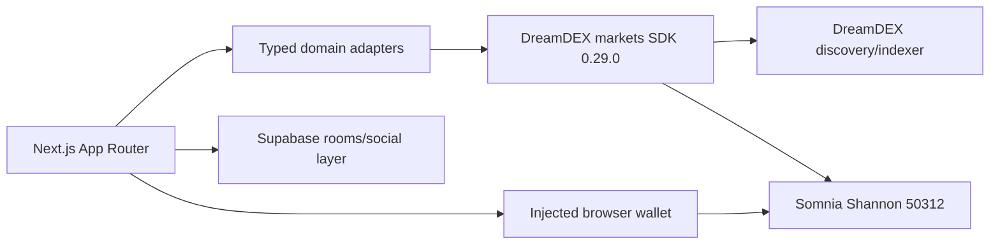

<div align="center">

# DreamRooms

### Social prediction rooms for live DreamDEX Event Contracts

Compare community conviction with live BTC/ETH market odds, then verify wallet activity on Somnia Shannon.

[Live app](https://dreamrooms.vercel.app/) · [Project brief](https://app.notion.com/p/3d78ee658434819385e6d12279b7187f?pvs=204) · [Public smoke report](docs/PUBLIC_SMOKE_TEST.md)

**Shannon testnet · self-custody · manual wallet signatures · English / Hindi**

</div>

---

## The idea

Prediction markets are useful, but the experience is often solitary and hard to explain. DreamRooms gives each live Event Contract a focused social space:

1. Discover a real BTC or ETH market.
2. Create a room around the market and share the thesis.
3. Compare room conviction with DreamDEX odds and order-book depth.
4. Connect a wallet when you are ready to act.
5. Keep protocol truth on-chain and verify the resulting position.

DreamRooms is a room around the market—not a replacement for the market.

## What is working

The deployed application was checked from a clean browser session on 2026-09-11.

| Surface               | Verified state                                                                           |
| --------------------- | ---------------------------------------------------------------------------------------- |
| Landing and discovery | Live BTC/ETH market discovery, structured strike/window data and honest empty-room state |
| Create room           | Market selection, order-book preview, room fields and wallet/preflight gating            |
| Portfolio             | Wallet-gated open and finalized position states without invented positions               |
| System status         | Shannon chain ID 50312, SDK/indexer read, dynamic venue discovery and live-market check  |
| Safety states         | Invalid room and malformed portfolio requests fail safely                                |

No transaction hash, filled order, claim or room-persistence result is claimed without independently verified evidence. See [known limitations](docs/KNOWN_LIMITATIONS.md).

## Screenshots

The landing/discovery, create-room, portfolio and system-status surfaces were visually reviewed in-browser. Stable PNG export was not available from the capture environment, so this README intentionally does not include fabricated or synthetic screenshots. When adding media, use captures from the deployed app and label them clearly as `LIVE` or `DEMO`.

## Product surfaces

### Live market discovery

- Dynamically discovers BTC and ETH Event Contracts through the official DreamDEX SDK.
- Re-reads market status from chain head before exposing an actionable market.
- Displays structured strike, cadence, trading window, odds, depth and freshness.
- Excludes markets outside their current trading window from the actionable list.

### Room experience

- Room title, thesis, language and selected market context.
- Community UP/DOWN sentiment and presence boundaries.
- Live market odds beside the room signal.
- Monochrome, mobile-first layout with reduced-motion support.

### Wallet and verification boundaries

- Explicit Somnia Shannon network gate: chain ID `50312`.
- Wallets sign in the browser; no private key belongs in the application environment.
- Trade preparation uses integer-safe tick and lot conversions.
- Approval and order actions are separate, bounded and manual.
- Receipt status, fill events and position readback are required before a trade is considered verified.

### Portfolio and claims

- Open positions are read from the chain-backed DreamDEX path.
- Finalized markets are scanned separately from the live-market list.
- Claimable states are shown only when the authoritative read path supports them.

## Architecture



### Truth boundaries

| Data                          | Source of truth                                  |
| ----------------------------- | ------------------------------------------------ |
| Market discovery              | DreamDEX SDK/indexer, then chain verification    |
| Status and expiry             | Somnia Shannon chain head                        |
| Order-book display            | DreamDEX binary order-book read                  |
| Wallet transaction            | Injected wallet and transaction receipt          |
| Position and settlement       | Chain-backed DreamDEX read path                  |
| Rooms, presence and sentiment | Supabase, never used to fabricate protocol state |

## Built with

Next.js App Router · React · strict TypeScript · Tailwind CSS · accessible semantic components · `@somnia-chain/markets-sdk` `0.29.0` · `viem` / `wagmi` · Supabase · Vitest · Testing Library · ESLint · Prettier · Vercel

## Run locally

Requirements: Node.js 22+, npm, and an injected EVM wallet only for manual wallet testing.

```powershell
npm ci
npm run dev
```

Open [http://localhost:3000](http://localhost:3000). Copy the secret-free variable contract when needed:

```powershell
Copy-Item .env.example .env.local
```

For deterministic fixture review only:

```powershell
$env:DREAMROOMS_DATA_MODE = "demo"
npm run dev
```

Demo fixtures are visibly labelled `DEMO` and must never be presented as live evidence. Never add a wallet private key to `.env.local`.

## Quality gate

```powershell
npm run typecheck
npm run lint
npm test -- --run
npm run format:check
npm run build
git diff --check
```

The external DreamDEX read-only smoke test is opt-in:

```powershell
$env:RUN_DREAMDEX_SMOKE = "1"
npm test -- src/lib/dreamdex/integration.smoke.test.ts --reporter=verbose
```

## Project map

```text
src/app/                 App Router pages and route handlers
src/components/          UI, wallet and room surfaces
src/lib/domain/          Typed product models and normalization
src/lib/dreamdex/        SDK adapter, discovery, gates and trade safety
src/lib/providers/       Provider boundaries for markets, rooms and portfolio
docs/                    Architecture, runbooks, evidence and limitations
supabase/migrations/     Additive social schema preparation
```

## Documentation

- [Architecture](docs/ARCHITECTURE.md)
- [Build status](docs/BUILD_STATUS.md)
- [Public smoke test](docs/PUBLIC_SMOKE_TEST.md)
- [Mock feature test report](docs/MOCK_TEST_REPORT.md)
- [Testnet runbook](docs/TESTNET_RUNBOOK.md)
- [Deployment evidence](docs/DEPLOYMENT_EVIDENCE.md)
- [Known limitations](docs/KNOWN_LIMITATIONS.md)
- [Release checklist](docs/RELEASE_CHECKLIST.md)
- [DoraHacks demo script](docs/DEMO_SCRIPT.md)

## Security and risk

DreamRooms is a Shannon testnet project. Event Contracts have binary outcomes; a trade can lose its full testnet stake. Users keep custody of their wallet and approve every signature manually. Service credentials are server-only and `.env.local` is excluded from Git.

## Current release status

The public read-only experience is available and the local quality gate passes. Supabase transport, two-session room persistence, a real wallet-signed order, settlement and final demo media remain evidence gates. The project does not turn a mock fixture or an unverified client claim into production proof.

## References

- [DreamDEX Event Contract documentation](https://docs.dreamdex.io/developers/event-contracts)
- [Official DreamDEX bot kit](https://github.com/somnia-chain/dreamdex-bot-kit)
- [Official hackathon template](https://github.com/IronicDeGawd/ec-dreamdex-hackathon-template)
- [DreamRooms live application](https://dreamrooms.vercel.app/)

## License

No license has been selected yet. Add one before treating the repository as reusable open source.
